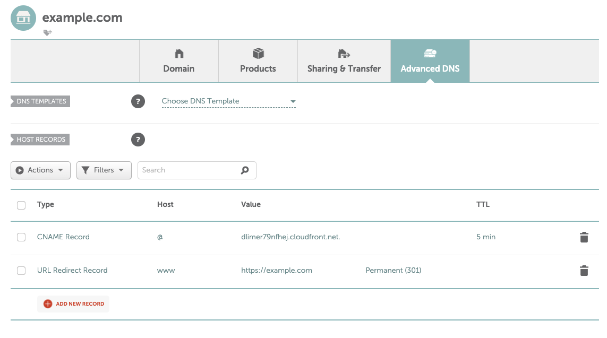

# AWS Static Website Terraform Module

 [](https://tldrlegal.com/license/mit-license)

Based on the [cloudmaniac/terraform-aws-static-website](https://github.com/cloudmaniac/terraform-aws-static-website) module, this is a Terraform Module to provision an AWS static website using S3 and CloudFront, without using Route53.

The redirect bucket (`www.example.com` redirected to `example.com`) has also been removed as this can be done using a URL Redirect at the domain.

Reources have been updated to suit updated Terraform and AWS provider versions.

## Features

This Terraform module creates the following AWS resources:

* **AWS Certificate Manager**: wildcard certificate for your domain.
* **S3**
  * Bucket #1: to store logs.
  * Bucket #2: to store the content (`example.com`).
* **CloudFront**
  * Distribution #1: to frontend the website.

## Requirements

* This module has been tested with [Terraform](https://www.terraform.io/downloads.html) 1.0.0.
* An AWS account and your credentials (`aws_access_key_id` and `aws_secret_access_key`) configured. There are several ways to do this (environment variables, shared credentials file, etc.). More information in the [AWS Provider](https://www.terraform.io/docs/providers/aws/index.html) documentation.
* Your domain ready to use on an external service such as [namecheap.com](https://namecheap.com).

## Usage

```HCL
provider "aws" {
  alias   = "us-east-1"
  region  = "us-east-1"
}

module "aws_static_website" {
  source = "tkav/static-website/aws"

  website_domain_main = "example.com"
}
```

**IMPORTANT**
This module uses EMAIL verification for the CloudFront distribution certificate.
During deployment you will recieve an email to verify the certificate.
Open the email and approve the validation request. 

When completed, something like the following will be outputted:

```
Outputs:

cloudfront_domain = "dlimer79nfhej.cloudfront.net"
```

Add an `@` CNAME record to your domain using the `cloudfront_domain` above and add a `www` URL Redirect record pointing to your domain:



Once complete, your site will soon be available using your domain.

Although AWS services are available in many locations, some of them require the `us-east-1` (N. Virginia) region to be configured:

* To use an ACM certificate with Amazon CloudFront, you must request or import the certificate in the US East (N. Virginia) region. ACM certificates in this region associated with a CloudFront distribution are distributed to all the geographic locations configured for that distribution.

For that reason, the module includes an aliased provider definition to create supplemental resources in the `us-east-1` region when required. Remaining resources from the module will inherit default (un-aliased) provider configurations from the parent.

## Inputs

| Name | Description | Type | Default | Required |
|------|-------------|:----:|:-------:|:--------:|
| website_domain_main | Domain for the website (e.g., `example.com`) | string | - | yes |

## Outputs

| Name | Description |
|------|-------------|
| cloudfront_domain | CloudFront Distribution Domain |

## Authors

Initial Module written by [@cloudmaniac](https://github.com/cloudmaniac). Modified by [@tkav](https://github.com/tkav) to remove Route53 and allow use with external domain services.

Contributions and comments are welcomed.
